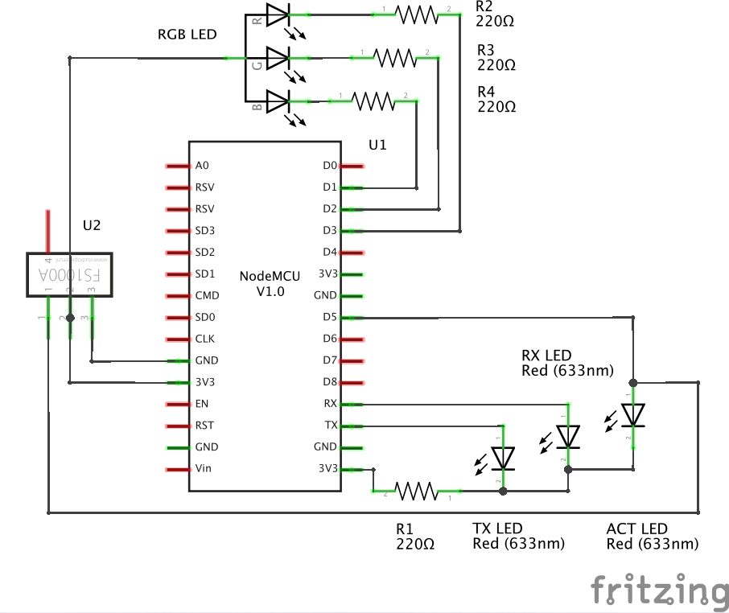

==========
Full Power
==========

Welcome to that huge Object-Oriented Arduino Sketch.

It is one elementary part of my home automation setup.
I use it to control my wireless power sockets.

For more information visit the `project description`_.
This project is used in `master_control`_!

Hardware
========

- Some esp8266 (ESP-12E) board
- FS1000A 433MHz transmitter
- RGB-LED
- Two normal LEDs (Rx/Tx activity)
- Four resistors, some wires...

The wiring is rather straightforward.

Features
========

While booting, the board loads a config file stored in SPIFFS or it
will create one with default settings.

It uses the config, to know wich wifi to join. There it announces
the included webserver (e.g. ``device.local``) via MDNS.

Visiting that webpage one may control the configured wireless power sockets
and the included RGB-LED (now with fancy RGB value sliders).

The included shell waiting on the serial can be used to..

- change the configuration, store to or (re-)load from flash.
- dial or hangup wifi
- control power and/or led
- show statistics
- ...

But it is also possible to talk to the api directly, recieving a json response:

* Fade LED to red::

    curl device.local/light/fade/0xff0000

* Flash LED in green::

    curl device.local/light/flash/0x00ff00

* Fade LED to some random color::

    curl device.local/light/fade/

| Colors can also be passed as decimal numbers (blue = ``255``), or in hex
  prefixed it with the ``#``-sign.
| But do not forget to encode it (blue = ``%230000ff``).

* Switch sockets on and off by raw address::

    curl device.local/power/full/0110100100

    curl device.local/power/null/0110100100

| If this address is stored in the config
  (family = ``01101``, switch = ``00100``),
| it's name would become ``4`` (``00100`` == ``4`` decimal).

* Switch sockets by configured name::

    curl device.local/power/full/4

.. _project description: https://www.der-beweis.de/build/full_power
.. _master_control: https://github.com/spookey/master_control
