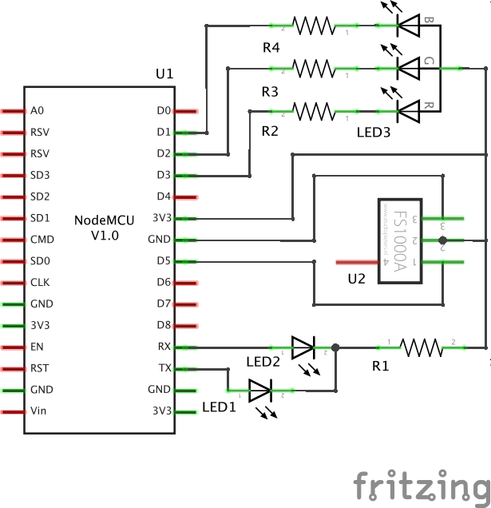

==========
Full Power
==========

Welcome to my first Object-Oriented Arduino Sketch.

The Hardware in use is some esp8266 (ESP-12E) Board.

It can control wireless sockets, and one RGB LED.
The Board joins your WiFi, and is then available at ``hostname.local``.

To trigger actions, send some GET requests:

* Fade LED to red::

    curl hostname.local -d color="#ff0000" -d light="fade"

* Flash LED in green::

    curl hostname.local -d color="#00ff00" -d light="flash"

* Switch Socket ``0110100100`` on and off::

    curl hostname.local -d power="0110100100" -d state="FULL"

    curl hostname.local -d power="0110100100" -d state="null"

For more information visit the `project description`_.

The wiring is rather simple:

.. _project description: https://www.der-beweis.de/build/full_power/
